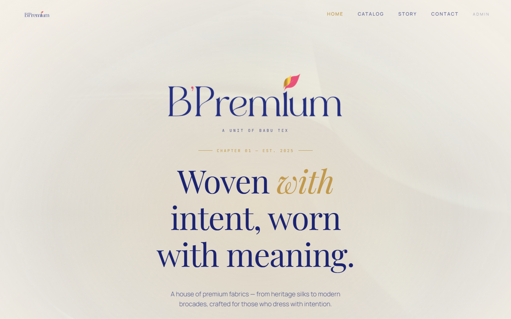

# B'Premium Fabric Catalogue

Production catalogue and enquiry platform case study for a premium textile brand.

## Overview

B'Premium combines editorial storytelling with a curated digital fabric catalogue and direct customer-enquiry journeys.

## Product Experience

- Responsive editorial landing experience
- Filterable product catalogue
- Product-detail and PDF catalogue access
- WhatsApp-led enquiry conversion flow
- Contact, story and brand-content sections
- Admin-facing catalogue entry point

## My Contribution

Selected professional work demonstrating full-stack product thinking, responsive UI implementation, catalogue UX and business workflow integration.

## Live Website

[Visit B'Premium](https://bpremium.in/)

> Portfolio case study. Brand names and website content belong to their respective owners.
